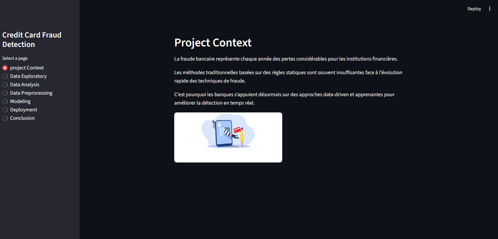
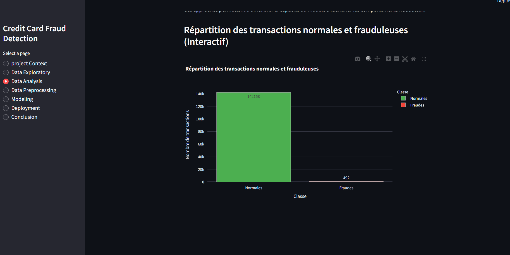
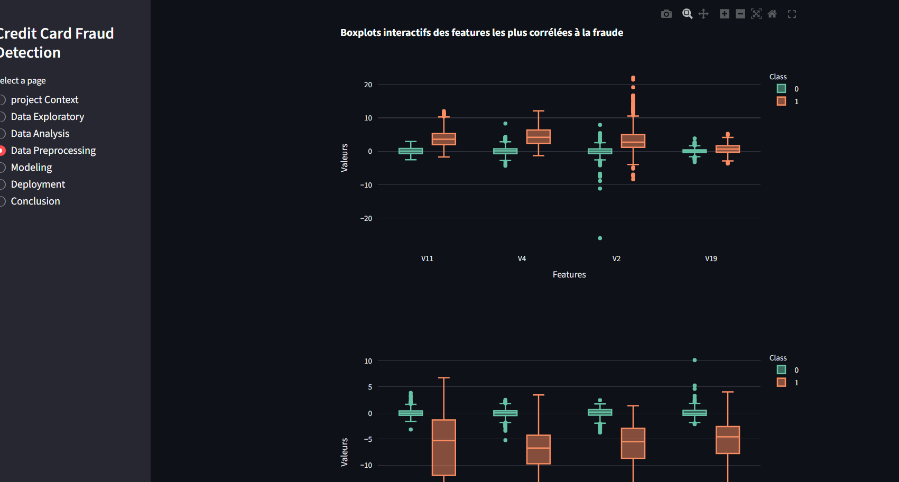
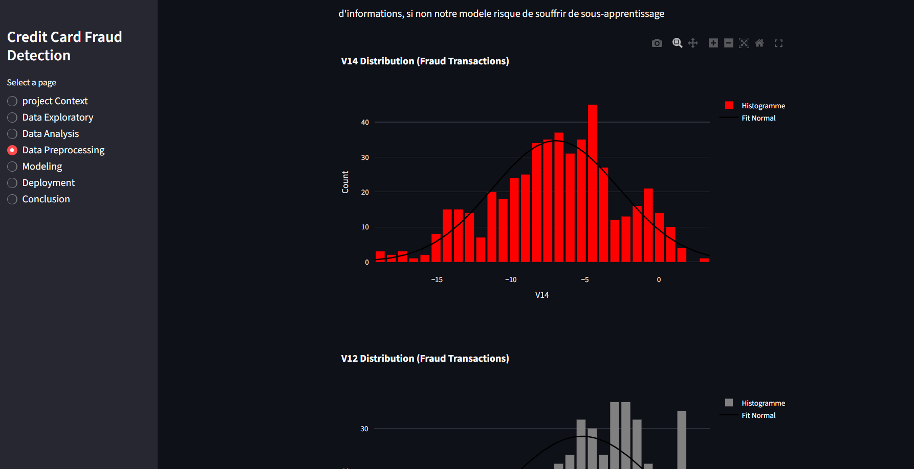
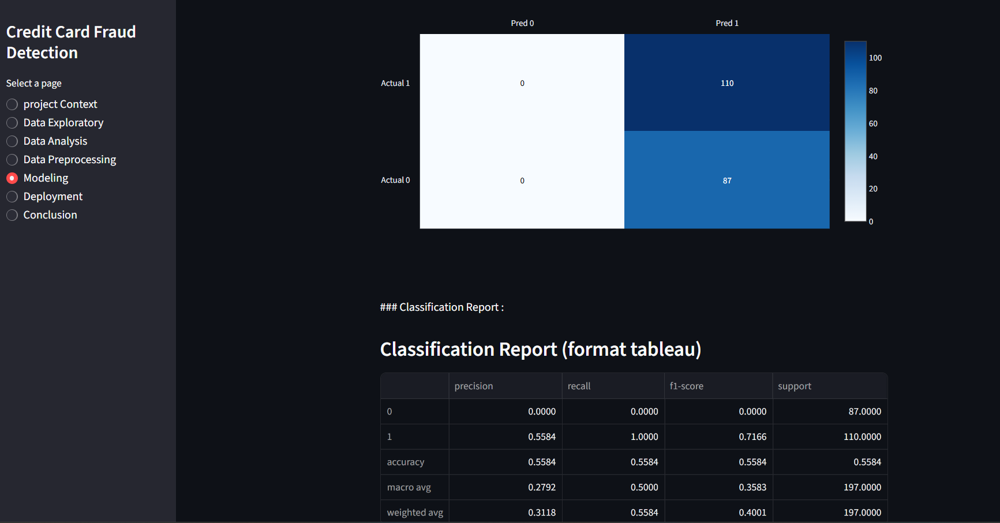

## Objectif du projet

Ce projet a pour objectif de développer un modèle de Machine Learning capable de détecter automatiquement les transactions bancaires potentiellement frauduleuses.

Grâce à l’analyse de données historiques de transactions, nous cherchons à :

- Identifier les comportements inhabituels des utilisateurs 
- Réduire le nombre de fraudes non détectées 
- Minimiser les faux positifs pour ne pas bloquer des clients légitimes ️

## Contexte
  
La fraude bancaire représente chaque année des pertes considérables pour les institutions financières.
Les méthodes traditionnelles basées sur des règles statiques sont souvent insuffisantes face à l’évolution rapide des techniques de fraude.
C’est pourquoi les banques s’appuient désormais sur des approches data-driven et apprenantes pour améliorer la détection en temps réel.

## ML Method

- Analyse de donnees ( Random undersampling, visualisation, matrice de correlation, boxplot, Distribution des donnees ,suppression oultliers)
- Data Exploratory & Data Analysis
- Data Preprocessing, 
- Modeling 
- Deployment


### Architecture de déploiement


**L’application est déployée sur AWS. Toutefois, par mesure de sécurité, j’ai choisi de fermer le port d’accès.**

### Présentation des interfaces.

1. Page d'accueil:

2. Quelques visualisations





3. Résultats d'entrainement de quelques modèles :


### Technologies utilisées

- Python
- Streamlit 
- AWS 
- scikit-learn 
- numpy 
- matplotlib 
- seaborn 
- Pandas


### Exécution

1. Cloner le repo

```bash
# Cloner le dépôt
git clone https://github.com/yann200/Credit-card-fraud-detection.git

# Entrer dans le dossier
cd Credit-card-fraud-detection
```

2. Creer un environnement virtuel & Installer les differents package

```bash 
# Creer l;environnement virtuel
python -m venv fraud_env

# Activer l'environnement
fraud_env/Scripts/activate
```
3. Lancer l'application Streamlit

```bash
streamlit run streamlit_credit_card.py
```

